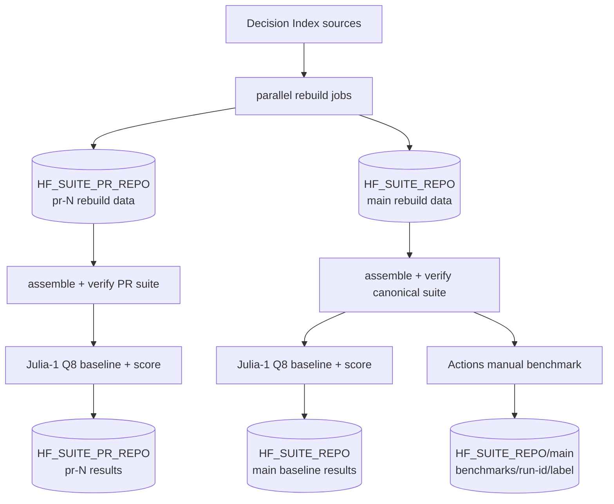
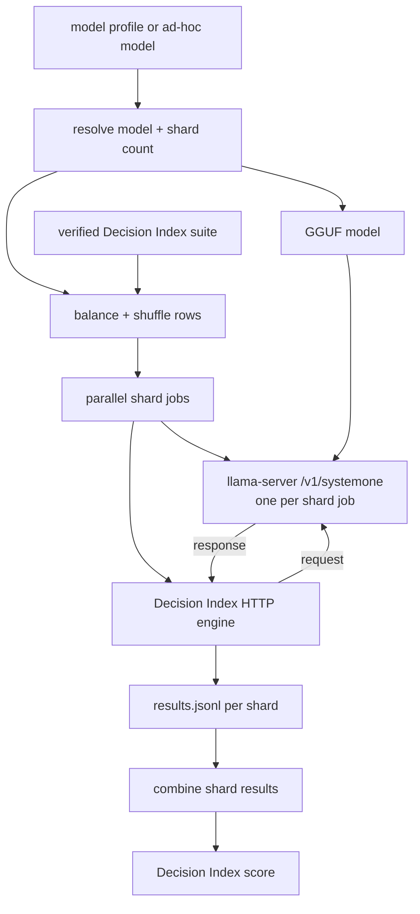

# Pipeline

## Components

- Decision Index builds and verifies the suite, runs the HTTP engine, and scores results.
- llama.cpp serves the model through `/v1/systemone`.
- GitHub Actions runs suite build, evaluation, and scoring jobs.
- Hugging Face dataset repos store the canonical suite and evaluation outputs.

Project code is limited to shard planning/staging, llama-server lifecycle and process
metrics, and CI orchestration.

## Data lifecycle



Pull requests build and evaluate against their own `HF_SUITE_PR_REPO/pr-N` data.
Pushes to `main` rebuild `HF_SUITE_REPO/main`; that verified suite is the canonical
input for later manual benchmarks.

## Evaluation run



## CI workflow

[`ci.yml`](workflows/ci.yml) runs on pull requests and pushes to `main`.

1. Rebuild base Decision Index source groups.
2. Rebuild added benchmarks for the pinned edition.
3. Assemble and verify the suite with Decision Index.
4. Split scoreable rows across evaluation jobs.
5. Run Decision Index against llama.cpp's `/v1/systemone` endpoint.
6. Combine the result files and run Decision Index scoring.

The Julia-1 Q8 profile currently uses 32 evaluation shards with at most 16 running
concurrently. `scripts/split_suite.py` balances rows by Decision Index
`proxy_tokens`, then deterministically shuffles each shard.

Decision Index result statuses are passed through to its scorer. The final score job
requires `scores.json.complete == true`.

## Manual benchmark workflow

[`benchmark.yml`](workflows/benchmark.yml) runs from the Actions page and uses the
canonical suite already stored in `HF_SUITE_REPO`.

The workflow accepts either:

- a saved profile from `models.json`; or
- an ad-hoc Hugging Face GGUF repo, quant, and result label.

It also accepts optional overrides for shard count, maximum parallel jobs, context
size, batch size, physical batch size, and extra `llama-server` arguments.

Each run writes to:

```text
benchmarks/<github-run-id>/<label>/
├── shards/
└── summary/
```

## Suite build

For Decision Index 0.2.1:

- base rows are rebuilt from the 0.1 sources;
- catalog IDs sharing a normalizer run together;
- ToolRet (2) and BRIGHT (36) run together because BRIGHT reads ToolRet's retrieval
  mapping during normalization;
- each added 0.2.x benchmark is rebuilt separately.

`scripts/suite_plan.py` derives base groups from the pinned Decision Index source.
`scripts/stage_suite_shards.py` restores the files to the layout expected by Decision
Index assembly.

## Storage

| Purpose | Repository | Revision |
| --- | --- | --- |
| `main` CI | `HF_SUITE_REPO` | `main` |
| pull request N | `HF_SUITE_PR_REPO` | `pr-N` |

Each CI storage revision uses:

```text
decision-index/<edition>/<decision-index-ref>/
├── base/<group>/normalized/
├── added/<catalog-id>/added-rows.jsonl
└── suite/
```

On `main`, the `suite/` directory in `HF_SUITE_REPO/main` is the canonical suite
used by manual benchmark runs.

CI evaluation results are stored under:

```text
decision-index/<edition>/<decision-index-ref>/eval/<profile>/<llama-ref>/
├── shards/
└── summary/
```

A new run for the same pull request replaces its scratch `pr-N` branch.
[`cleanup-pr-data.yml`](workflows/cleanup-pr-data.yml) deletes that branch when the
pull request closes or merges.

## Pins

`stack.json` records the llama.cpp revision, Decision Index revision, and Decision
Index edition. `models.json` records saved model profiles, shard counts, and
model-specific `llama-server` arguments.
