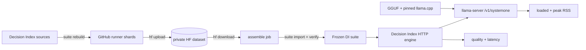

# Pipeline architecture

This repository connects three existing pieces:

- [Decision Index](https://github.com/apolinario/decision-index) for benchmark construction and scoring.
- [llama.cpp](https://github.com/ggml-org/llama.cpp) for local `/v1/systemone` inference.
- a private Hugging Face dataset repo for durable suite artifacts.

We keep the glue here small. Decision Index owns benchmark semantics; Hugging Face
owns storage; this repo owns orchestration and the llama-server resource measurements.



## Why the suite is sharded

A full Decision Index rebuild needs more temporary disk than a standard GitHub-hosted
runner can comfortably provide. The expensive part is source acquisition and
normalization, so those stages run independently and only their reduced outputs are
kept.

Decision Index documents the frozen-suite layout, source pins, and licensing in
[docs/suite.md](https://github.com/apolinario/decision-index/blob/main/docs/suite.md).
We do not duplicate that logic.

### Base suite

For the current 0.2.1 edition, the base rows are rebuilt from Decision Index's 0.1
sources, then Decision Index applies the 0.2.x release cuts during final assembly.
Most base catalog IDs can be partitioned by normalizer. Catalog IDs that share a
normalizer run together because it expects all of its source data to be present.

There is one extra dependency discovered during the end-to-end build: BRIGHT reads
ToolRet's retrieval mapping while normalizing, so catalog IDs **2 and 36** share a
worker even though they use different builders.

`scripts/suite_plan.py` derives these groups from the pinned Decision Index source
and contains only that extra dependency.

### Added 0.2.x benchmarks

The added benchmarks are already independent in Decision Index, so each catalog ID is
one shard. Their canonical order comes directly from Decision Index's
`adapters_added.ORDER`.

## Where the data lives

The GitHub repository stays public. Rebuilt benchmark rows stay in the private
`datGryphon/systemone-eval-data` dataset because the upstream datasets have mixed
redistribution terms.

```text
decision-index/<edition>/<decision-index-ref>/
├── base/<builder-group>/normalized/*.jsonl
├── added/<catalog-id>/added-rows.jsonl
└── suite/
    ├── selected-rows.jsonl.gz
    ├── added-rows.jsonl.gz
    └── ...
```

The Decision Index edition and Git ref are part of the path so a suite refresh cannot
silently replace data built from a different benchmark definition.

Hugging Face access is provided by:

- `HF_TOKEN_READ` — read-only CI/evaluation access
- `HF_TOKEN_WRITE` — suite refresh writes
- `HF_SUITE_REPO` — repository variable naming the private dataset repo

The workflows use the upstream `hf` CLI directly.

## Suite refresh

[`suite-refresh.yml`](workflows/suite-refresh.yml) is manual-only.

For each planned shard it:

1. checks the private HF cache;
2. runs Decision Index `suite rebuild` only when the shard is missing;
3. uploads the normalized/base or added-row output with `hf upload`.

The final assembly job downloads the shards and `scripts/stage_suite_shards.py`
places them back into the layout expected by Decision Index. From there Decision
Index takes over again:

```text
suite rebuild --skip-download --skip-normalize
        ↓
suite import
        ↓
suite verify
        ↓
hf upload <verified suite>
```

`suite import` and `suite verify` are the authority for whether the assembled data
matches the pinned edition. See the upstream
[suite documentation](https://github.com/apolinario/decision-index/blob/main/docs/suite.md)
for the hashes and edition rules.

## Evaluation CI

[`ci.yml`](workflows/ci.yml) is deliberately smaller than the suite builder. It does
not rebuild benchmark datasets.

It builds the pinned llama.cpp, installs the pinned Decision Index, and runs one
Decision Index HTTP request against a small repository fixture. The HTTP contract is
the same one used by real evaluations; see Decision Index
[docs/engines.md](https://github.com/apolinario/decision-index/blob/main/docs/engines.md#http).

The wrapper around that run exists for measurements Decision Index does not own:

- llama-server loaded-idle RSS
- llama-server peak RSS (`VmHWM`)
- runner hardware metadata
- exact `stack.json` and model profile

Full benchmark quality and latency remain Decision Index outputs.

## Pins and refreshes

`stack.json` pins:

- llama.cpp Git ref
- Decision Index Git ref
- Decision Index edition

Changing the Decision Index ref or edition creates a new HF suite namespace and
requires a suite refresh. Changing only llama.cpp does not rebuild benchmark data; it
creates a new inference profile against the same frozen suite.

## What we intentionally do not own

- benchmark definitions or ground truth
- Decision Index scoring
- a parallel suite format
- a Hugging Face client
- generated copies of upstream documentation

The project-specific code is limited to the source-aware shard plan, shard staging,
and llama-server runtime measurements.
