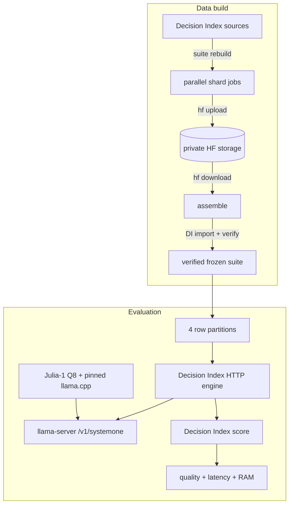

# Pipeline architecture

This repo connects [Decision Index](https://github.com/apolinario/decision-index),
[llama.cpp](https://github.com/ggml-org/llama.cpp), GitHub Actions, and two private
Hugging Face dataset repos.

Decision Index owns benchmark semantics and scoring. llama.cpp owns inference.
Hugging Face owns storage. This repo owns the orchestration between them and the
llama-server resource measurements.



## The pipeline is intentionally end to end

[`ci.yml`](workflows/ci.yml) runs on every pull request and every push to `main`.
It does not substitute representative fixtures for the real benchmark path:

1. rebuild every base and added Decision Index shard;
2. assemble and verify the complete frozen suite;
3. evaluate the complete suite with Julia-1 Q8;
4. score the combined results with Decision Index.

The evaluation is split four ways only to stay comfortably inside a GitHub job's
runtime limit. `scripts/split_suite.py` partitions the scoreable rows; the final
score job recombines all four standard Decision Index result files before scoring.

The suite format, hashes, source pins, and licensing rules remain upstream concerns:
[Decision Index suite docs](https://github.com/apolinario/decision-index/blob/main/docs/suite.md).
The runtime contract is the upstream
[HTTP engine](https://github.com/apolinario/decision-index/blob/main/docs/engines.md#http).

## Data-build sharding

A complete source rebuild needs more temporary disk than one standard GitHub runner.
We split acquisition/normalization across workers, then hand the reduced outputs back
to Decision Index for canonical assembly.

For the current 0.2.1 edition:

- base rows are rebuilt from the 0.1 sources;
- catalog IDs sharing a normalizer run together;
- ToolRet (2) and BRIGHT (36) share a worker because BRIGHT reads ToolRet's retrieval
  mapping during normalization;
- each added 0.2.x benchmark is its own shard.

`scripts/suite_plan.py` derives the normalizer groups from the pinned Decision Index
source and carries only the 2/36 exception. `scripts/stage_suite_shards.py` restores
the shard outputs to the layout Decision Index expects for assembly.

## Storage boundary

Canonical and PR-generated data never share a Git history.

| Purpose | Repository | Revision |
| --- | --- | --- |
| merged `main` | `HF_SUITE_REPO` | `main` |
| pull request N | `HF_SUITE_PR_REPO` | `pr-N` |

The current repository variables are:

- `HF_SUITE_REPO=datGryphon/systemone-eval-data`
- `HF_SUITE_PR_REPO=datGryphon/systemone-eval-data-pr`

Both use `HF_TOKEN_READ` and `HF_TOKEN_WRITE`.

Within either revision:

```text
decision-index/<edition>/<decision-index-ref>/
├── base/<group>/normalized/*.jsonl
├── added/<catalog-id>/added-rows.jsonl
├── suite/
└── eval/julia-1-q8/<llama-ref>/
    ├── shards/
    └── summary/
```

### Pull requests keep one generation

A PR run is keyed by PR number, not commit SHA.

When a new head is pushed:

1. GitHub cancels the older run for that PR;
2. the `pr-N` HF branch is deleted and recreated from the scratch repo's `main`;
3. the complete pipeline starts from clean storage.

The Git SHA is kept in evaluation metadata instead of the storage path.

[`cleanup-pr-data.yml`](workflows/cleanup-pr-data.yml) shares the PR pipeline's
concurrency key, so closing a PR first cancels any still-running build. It then
deletes `pr-N`. The cleanup can also be run manually with a PR number. Because the scratch
dataset keeps each PR on its own branch, deleting the branch removes that PR's Git
reference instead of accumulating generations under one shared branch.

### Main regenerates

A merge to `main` runs the same complete pipeline against `HF_SUITE_REPO/main`.
It regenerates every shard rather than promoting PR artifacts. Existing files for the
same Decision Index edition/ref are cleared first.

## Evaluation output

Decision Index owns request/result timing and benchmark quality. Our evaluation
wrapper adds the measurements needed for always-on local models:

- loaded-idle llama-server RSS
- peak llama-server RSS (`VmHWM`)
- runner CPU/RAM metadata
- GitHub run/SHA provenance
- exact `stack.json` and model profile

Shard results are written with Decision Index's `--compact` format. The final score
job requires `scores.json.complete == true`.

## Pins

`stack.json` records the llama.cpp ref, Decision Index ref, and Decision Index
edition. `models.json` records the model repo and quant.

Changing the Decision Index ref or edition creates a new canonical namespace.
Changing llama.cpp creates a new evaluation namespace against the same suite.

## Boundary

We do not own benchmark definitions, ground truth, scoring, a parallel suite format,
or a Hugging Face client. Project-specific code is limited to shard planning/staging,
evaluation partitioning, and llama-server resource measurement.
