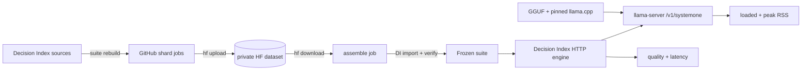

# Pipeline architecture

This repo connects [Decision Index](https://github.com/apolinario/decision-index),
[llama.cpp](https://github.com/ggml-org/llama.cpp), GitHub Actions, and a private
Hugging Face dataset. The glue here is intentionally small.



## Design choices

### Decision Index stays authoritative

Decision Index owns benchmark acquisition, row formats, release cuts, hashes, and
scoring. We call its CLI rather than reproducing that logic.

Relevant upstream docs:

- [Frozen suite and source/licence details](https://github.com/apolinario/decision-index/blob/main/docs/suite.md)
- [HTTP engine contract](https://github.com/apolinario/decision-index/blob/main/docs/engines.md#http)

### Build the suite in shards

The full rebuild needs too much temporary disk for one standard GitHub runner. We
split only the expensive acquisition/normalization stage, then let Decision Index
reassemble and verify the canonical suite.

For the current 0.2.1 edition:

- base rows are rebuilt from the 0.1 sources;
- catalog IDs sharing a normalizer run on the same worker;
- ToolRet (2) and BRIGHT (36) also share a worker because BRIGHT reads ToolRet's
  retrieval mapping during normalization;
- each added 0.2.x benchmark is its own shard.

`scripts/suite_plan.py` derives the normalizer groups from the pinned Decision Index
source and carries only the 2/36 exception.

### Keep rebuilt data private

The GitHub repo is public, but rebuilt benchmark rows are not. Upstream datasets have
mixed redistribution terms, so persistent artifacts live in the private
`datGryphon/systemone-eval-data` dataset.

```text
decision-index/<edition>/<decision-index-ref>/
├── base/<builder-group>/normalized/*.jsonl
├── added/<catalog-id>/added-rows.jsonl
└── suite/
```

The edition and Decision Index ref are part of the path. Updating either creates a new
cache namespace instead of overwriting an older frozen suite.

The workflows use the upstream `hf` CLI directly. GitHub provides:

- `HF_TOKEN_READ`
- `HF_TOKEN_WRITE`
- `HF_SUITE_REPO`

### Rehydrate, then hand control back to Decision Index

[`suite-refresh.yml`](workflows/suite-refresh.yml) is manual-only. Missing shards are
built and uploaded; existing shards are reused.

The assembly job downloads them, and `scripts/stage_suite_shards.py` performs the
small amount of layout/order glue Decision Index does not expose as a CLI command.
After that:

```text
DI suite rebuild --skip-download --skip-normalize
        ↓
DI suite import
        ↓
DI suite verify
        ↓
hf upload <verified suite>
```

The current 0.2.1 pipeline has completed this path end-to-end successfully. A suite is
publishable only after Decision Index accepts the pinned edition's canonical data.

### Keep evaluation CI separate

[`ci.yml`](workflows/ci.yml) does not rebuild benchmark datasets. It proves the
runtime contract with one small repository fixture:

```text
pinned llama.cpp + GGUF
        ↓
/v1/systemone
        ↑
pinned Decision Index HTTP engine
```

Decision Index owns request/result timing and benchmark quality. Our wrapper adds the
runtime measurements we care about when comparing always-on local models:

- loaded-idle llama-server RSS
- peak llama-server RSS (`VmHWM`)
- runner CPU/RAM metadata
- exact `stack.json` and model profile

## Pins

`stack.json` records the llama.cpp ref, Decision Index ref, and Decision Index
edition. `models.json` records the model repo and quant.

A Decision Index ref/edition change requires a suite refresh. A llama.cpp-only change
does not; it evaluates against the same frozen suite.

## Boundary

We do not own benchmark definitions, ground truth, scoring, a parallel suite format,
or a Hugging Face client. Project-specific code is limited to shard planning/staging
and llama-server resource measurement.
